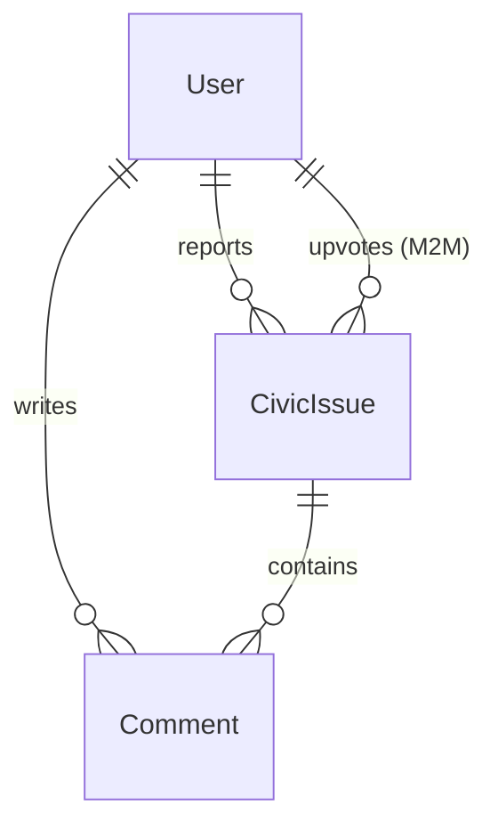
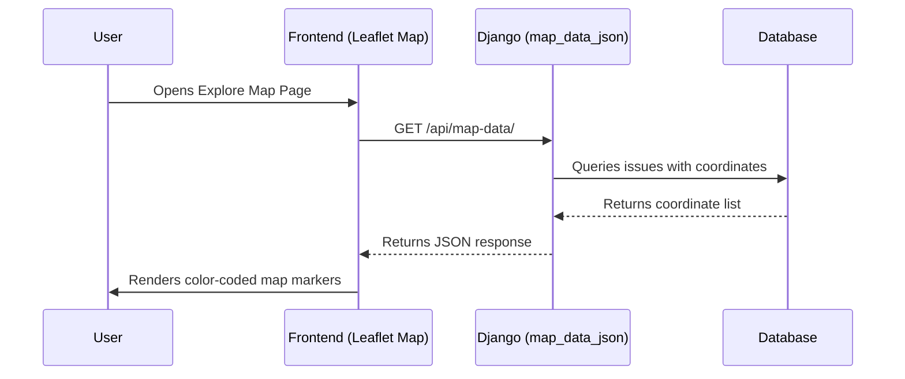
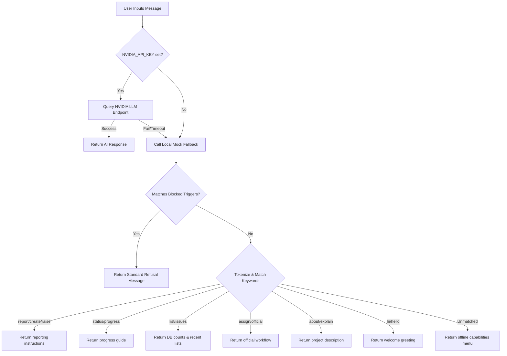

# CivicTrack Enterprise Architecture & Operations Manual

Welcome to the comprehensive technical documentation for **CivicTrack**, a modern, real-time civic engagement and infrastructure tracking web platform. 

This document serves as an exhaustive guide for developers, system administrators, and municipal operators to understand, deploy, maintain, and verify the CivicTrack application.

---

## 1. Project Overview & Core Mission

### 1.1 Problem Statement
In many local municipalities, the process of reporting civic infrastructure defects—such as road potholes, broken streetlights, illegal waste dumping, public health hazards, and sewage leaks—is slow, opaque, and disconnected. Citizens lack visibility into whether their reports have been received, which department is handling them, and what the progress looks like. Conversely, municipal authorities struggle to receive accurate, location-verified complaints accompanied by photo evidence, leading to scheduling inefficiencies.

### 1.2 The CivicTrack Solution
**CivicTrack** bridges this communication gap by establishing a transparent, collaborative, and structured pipeline:
* **Citizen Reporting:** Citizens report local issues with verified photos and GPS coordinates placed directly on an interactive map.
* **Community Validation:** Citizens can upvote existing reports to signal urgency, reducing duplicate tickets while highlighting major problem areas, and comment to coordinate details.
* **Official Pipeline:** City staff and administrators verify, categorize, and assign reports to municipal departments while changing status.
* **Automated Feedback Loop:** Citizens receive automatic email updates whenever their reported issues change state.
* **AI-Guided Interface:** A custom-trained conversational widget helps users check counts, list complaints, and understand how to navigate the platform.

---

## 2. Directory Structure & File Map

Below is the directory structure of the CivicTrack project, mapping out every configuration, template, and script:

```text
civictrack/
│
├── civictrack/                           # Project Configuration Directory
│   ├── __init__.py                       # Package initialization
│   ├── asgi.py                           # ASGI entry-point for async servers
│   ├── settings.py                       # Global Django settings & Chatbot variables
│   ├── urls.py                           # Root URL routing configurations
│   └── wsgi.py                           # WSGI entry-point for web servers
│
├── issues/                               # Main Application App
│   ├── __init__.py                       # Package initialization
│   ├── admin.py                          # Django Admin panel configurations
│   ├── apps.py                           # Issues app configuration definition
│   ├── chatbot.py                        # Chatbot backend pipeline & local engine
│   ├── forms.py                          # Django form validations (CivicIssueForm)
│   ├── models.py                         # Relational database models (CivicIssue, Comment)
│   ├── tests.py                          # Integrated unit testing suite (28 assertions)
│   ├── urls.py                           # App-specific URL endpoint mappings
│   ├── views.py                          # Core business logic and controllers
│   │
│   ├── management/                       # Custom Django Management Commands
│   │   └── commands/
│   │       ├── __init__.py
│   │       └── create_authority.py       # Terminal script to create staff users
│   │
│   └── migrations/                       # Database migration schema logs
│       └── ...
│
├── media/                                # Uploaded Media Files
│   └── civic_issues_gallery/             # citizen upload directory for issue pictures
│
├── templates/                            # UI Layer (HTML, CSS, JavaScript)
│   ├── chatbot_widget.html               # Floating glassmorphic AI widget & JS controller
│   ├── check_progress.html               # Filterable paginated grid of reported issues
│   ├── footer.html                       # Global page footer component
│   ├── home.html                         # Home dashboard, features, and contact page
│   ├── imprint.html                      # Legal imprint disclosure page
│   ├── issue_detail.html                 # Complete single issue page (Map, Comments, Staff Editor)
│   ├── login.html                        # Authentication login view
│   ├── map.html                          # Explore view map of all coordinates
│   ├── navbar.html                       # Global navigation header (includes Chatbot globally)
│   ├── privacy_policy.html               # User privacy and terms disclosure
│   ├── raise_an_issue.html               # Coordinates picker map and file submission form
│   ├── register.html                     # Citizen registration form
│   ├── terms_of_service.html             # Usage terms disclosure
│   └── images/                           # Static UI images and illustrations
│       ├── logo.png
│       ├── login.png
│       ├── contact.png
│       ├── Earth model.png
│       ├── Family.png
│       ├── GPS.png
│       ├── Group-1.png
│       ├── Group-2.png
│       ├── Group-3.png
│       └── tracking.png
│
├── db.sqlite3                            # SQLite3 relational database file
├── manage.py                             # Django CLI utility wrapper
└── documentation.md                      # Developer operations guide (this file)
```

---

## 3. Technical Architecture & Tech Stack Matrix

CivicTrack uses a monolithic Model-Template-View (MTV) pattern designed to run lightweight, secure, and fast:

| Component | Technology | Version / Specifics | Purpose |
| :--- | :--- | :--- | :--- |
| **Backend Framework** | Django | 6.0+ | Server-side routing, request controller, forms validation, ORM. |
| **Database** | SQLite3 | 3.x (Default relational) | Simple local storage for system records, coordinates, and comments. |
| **Styling Framework** | Bootstrap | 5.3.8 (via CDN) | Responsive layout, flex grids, and default buttons/modals. |
| **Custom Styling** | Vanilla CSS | CSS3 Custom Properties | Sleek dark modes, cards styling, and Glassmorphism widget details. |
| **Mapping Engine** | Leaflet.js | 1.9.4 (via CDN) | Renders maps, plots coordinates, and handles click geolocation pins. |
| **Icons Library** | FontAwesome | 6.x (via JS CDN Kit) | Decorative icons for buttons, sidebar navigation, and headers. |
| **Image Processing** | Pillow | Standard Python Library | Backend validation and scaling of user uploaded images. |
| **AI LLM API** | NVIDIA API | meta/llama-3.1-70b-instruct | Handles advanced multi-turn chatbot question completions. |
| **HTTP Client** | Requests | Standard Python Package | Communication client mapping backend chatbot queries to NVIDIA. |
| **Email Logs** | Django Console Mailer | settings.EMAIL_BACKEND | Prints status change updates to console in local environments. |

---

## 4. Database Model Schema Specification

The application defines two main custom models in [models.py](file:///c:/DataVally/civictrack/issues/models.py) mapping to the database schema:



### 4.1 CivicIssue Model (`issues_civicissue` Table)
Stores detailed reports of municipal defects submitted by users.

| Field Name | Django Field Type | Database Column constraints | Description |
| :--- | :--- | :--- | :--- |
| `id` | `AutoField` | `PRIMARY KEY AUTOINCREMENT` | Unique identifier for the ticket. |
| `name` | `CharField(max_length=150)` | `NOT NULL` | Short title summarizing the complaint. |
| `origin_location` | `CharField(max_length=255)` | `NOT NULL` | Street address or text location description. |
| `issue_details` | `TextField` | `NOT NULL` | Comprehensive description of the reported issue. |
| `uploaded_image` | `ImageField` | `upload_to='civic_issues_gallery/'` | Mandatory proof photo uploaded by user. |
| `created_at` | `DateTimeField` | `auto_now_add=True` | Timestamp when the entry was written. |
| `status` | `CharField(max_length=20)` | `default='Open'` | Resolution state: `Open`, `In Progress`, `Resolved`. |
| `user` | `ForeignKey(User)` | `on_delete=CASCADE, null=True, blank=True` | Submitting citizen. Cascades deletion; anonymous fallback allowed. |
| `latitude` | `FloatField` | `null=True, blank=True` | GPS Latitude from Leaflet map selection. |
| `longitude` | `FloatField` | `null=True, blank=True` | GPS Longitude from Leaflet map selection. |
| `votes` | `ManyToManyField(User)` | `related_name='voted_issues', blank=True` | Tracks users who upvoted to signal urgency (M2M relationship table). |
| `assigned_department` | `CharField(max_length=50)` | `choices=DEPARTMENT_CHOICES, default='Other'` | Municipal department handling resolution. |

#### Assigned Department Choices (`DEPARTMENT_CHOICES`):
* `Water`: "Water Supply & Sewage"
* `Roads`: "Roads & Traffic"
* `Sanitation`: "Sanitation & Waste"
* `Electricity`: "Electricity & Lighting"
* `Health`: "Public Health & Safety"
* `Other`: "Other/General" (Default choice)

### 4.2 Comment Model (`issues_comment` Table)
Stores user discussions on individual civic issues.

| Field Name | Django Field Type | Database Column constraints | Description |
| :--- | :--- | :--- | :--- |
| `id` | `AutoField` | `PRIMARY KEY AUTOINCREMENT` | Unique comment identifier. |
| `issue` | `ForeignKey(CivicIssue)` | `on_delete=CASCADE, related_name='comments'` | Associated civic issue ticket (cascade deleted). |
| `user` | `ForeignKey(User)` | `on_delete=CASCADE` | Submitting user (cascade deleted). |
| `content` | `TextField` | `NOT NULL` | Message content of the comment. |
| `created_at` | `DateTimeField` | `auto_now_add=True` | Timestamp of post creation. |

---

## 5. Detailed View & Controller Logic Analysis

All views reside in [views.py](file:///c:/DataVally/civictrack/issues/views.py) and process core HTTP operations:

### 5.1 Registration & Authentication Views

#### `register_view`
* **URL / Name:** `/register/` (`name='register'`)
* **HTTP Method:** GET, POST
* **Decorators:** None
* **Description:** Handles citizen signup.
* **Logic Flow:**
  1. GET renders [register.html](file:///c:/DataVally/civictrack/templates/register.html).
  2. POST collects inputs: `fullname`, `email`, `password`.
  3. Checks if a user already exists with the username equal to the submitted `email`. If yes, returns an error message.
  4. Calls `User.objects.create_user()` using the `email` as the `username`, `email` as the `email`, and `fullname` mapped to `first_name`. Saves to DB.
  5. Displays a success alert and redirects to the login view.

#### `login_view`
* **URL / Name:** `/login/` (`name='login'`)
* **HTTP Method:** GET, POST
* **Decorators:** None
* **Description:** Handles login operations.
* **Logic Flow:**
  1. GET renders [login.html](file:///c:/DataVally/civictrack/templates/login.html).
  2. POST collects inputs: `email` (as username) and `password`.
  3. **Dual-Path Authentication Check:**
     * *Direct Match:* Attempts `authenticate(username=email, password=password)` directly, since email is saved as the username.
     * *Database Lookup Match:* If direct authentication fails, queries `User.objects.get(email=email)` to fetch the actual username string and attempts authentication with that username.
  4. If authenticated, logs user in via `login()` and redirects to `home`. Else, sets error message.

#### `logout_view`
* **URL / Name:** `/logout/` (`name='logout'`)
* **HTTP Method:** GET
* **Decorators:** None
* **Description:** Clears sessions.
* **Logic Flow:**
  1. Calls Django's built-in `logout(request)` function to clear session records.
  2. Redirects to `/login/`.

---

### 5.2 Civic Issues Core Management Views

#### `home`
* **URL / Name:** `/` (`name='home'`)
* **HTTP Method:** GET
* **Decorators:** `@login_required`
* **Description:** Landing page and dashboard.
* **Logic Flow:**
  1. Retrieves all `CivicIssue` records from the database.
  2. Determines authorization indicators: `is_admin = request.user.is_superuser` and `is_authority = request.user.is_staff`.
  3. Renders [home.html](file:///c:/DataVally/civictrack/templates/home.html), passing the issue list and flags.

#### `civictrack_form`
* **URL / Name:** `/submit/` (`name='civic_details'`)
* **HTTP Method:** GET, POST
* **Decorators:** `@login_required`
* **Description:** Submits a new issue.
* **Logic Flow:**
  1. GET renders the coordinate selection map form [raise_an_issue.html](file:///c:/DataVally/civictrack/templates/raise_an_issue.html).
  2. POST retrieves: `name`, `location` (`origin_location`), `issue_details`, `image` file, `latitude`, and `longitude`.
  3. **Coordinate Validation:** Attempts to convert latitude/longitude text inputs to Python `float` types. On value conversion exceptions, defaults the fields to `None`.
  4. Mandatory validation ensures that the issue has a photo file.
  5. Saves a new `CivicIssue` record mapped to `request.user` and redirects to the home page.

#### `update`
* **URL / Name:** `/update/<int:id>/` (`name='update'`)
* **HTTP Method:** GET, POST
* **Decorators:** `@login_required`
* **Description:** Edits details of an existing issue.
* **Logic Flow:**
  1. Fetches the target issue by ID or returns a 404.
  2. **RBAC Guard:** Validates that the logged-in user is the creator (`issue.user == request.user`), a staff member (`is_staff`), or a superuser (`is_superuser`). If unauthorized, redirects to home with a permission error.
  3. GET renders [raise_an_issue.html](file:///c:/DataVally/civictrack/templates/raise_an_issue.html) populated with existing model records.
  4. POST collects modifications. If a new image file is uploaded, overwrites the old image; otherwise, preserves the existing file link. Converts and validates coordinate coordinates, then saves details.

#### `delete_issue`
* **URL / Name:** `/delete/<int:id>/` (`name='delete_issue'`)
* **HTTP Method:** GET
* **Decorators:** `@login_required`
* **Description:** Removes a reported ticket.
* **Logic Flow:**
  1. Fetches the issue or throws a 404.
  2. **RBAC Guard:** Checks if `request.user.is_staff` or `request.user.is_superuser` is `True`. If not authorized, sets an error alert and redirects.
  3. Calls `issue.delete()`, destroying database rows and associated fields, then redirects back to home.

#### `change_status`
* **URL / Name:** `/status/<int:id>/` (`name='change_status'`)
* **HTTP Method:** POST
* **Decorators:** `@login_required`
* **Description:** Transitions issue status and reassigns department.
* **Logic Flow:**
  1. Fetches the issue or throws 404.
  2. **RBAC Guard:** Verifies user is staff or admin.
  3. Fetches `status` and `department` parameters from POST.
  4. Validates inputs: checks status is in `['Open', 'In Progress', 'Resolved']` and department is in the keys of `DEPARTMENT_CHOICES`.
  5. Computes if values changed. If yes:
     * Saves changes to DB.
     * **Email Notification:** If `status` changed, and the original reporting user has an email address associated, triggers an automated notification mail.
     * Uses `django.core.mail.send_mail()` to dispatch a text notice indicating status transition details and a clickable link to view the ticket.
  6. Redirects back to the referrer page (HTTP_REFERER) or defaults to the progress view.

---

### 5.3 Citizen Interaction Views

#### `issue_detail`
* **URL / Name:** `/issue/<int:id>/` (`name='issue_detail'`)
* **HTTP Method:** GET
* **Decorators:** None (Accessible publicly for progress updates)
* **Description:** Detailed view of a single issue, including mapping, comments, and status modification form.
* **Logic Flow:**
  1. Fetches the issue by ID.
  2. Renders [issue_detail.html](file:///c:/DataVally/civictrack/templates/issue_detail.html), passing the issue object and the department selection list.

#### `upvote_issue`
* **URL / Name:** `/issue/<int:id>/upvote/` (`name='upvote_issue'`)
* **HTTP Method:** POST
* **Decorators:** `@login_required`
* **Description:** Toggles user upvotes.
* **Logic Flow:**
  1. Fetches issue.
  2. **Toggle Logic:** Checks if `request.user` is in `issue.votes.all()`.
     * *If voted:* Calls `issue.votes.remove(request.user)` to retract the upvote.
     * *If not voted:* Calls `issue.votes.add(request.user)` to add the user's vote.
  3. Redirects to the issue detail page.

#### `add_comment`
* **URL / Name:** `/issue/<int:id>/comment/` (`name='add_comment'`)
* **HTTP Method:** POST
* **Decorators:** `@login_required`
* **Description:** Appends a comment to the issue thread.
* **Logic Flow:**
  1. Fetches issue.
  2. Retrieves `content` and strips white spaces. If empty, throws validation error.
  3. Creates `Comment` record mapped to the current user and issue, saving to the database.
  4. Redirects to the detail page.

---

### 5.4 Mapping, Info, and Chatbot Views

#### `map_view`
* **URL / Name:** `/map/` (`name='map'`)
* **HTTP Method:** GET
* **Decorators:** None
* **Description:** Renders the city-wide issue map.
* **Logic Flow:**
  1. Pulls all `CivicIssue` objects containing latitude and longitude.
  2. Renders [map.html](file:///c:/DataVally/civictrack/templates/map.html).

#### `map_data_json`
* **URL / Name:** `/api/map-data/` (`name='map_data_json'`)
* **HTTP Method:** GET
* **Decorators:** None
* **Description:** API endpoint returning coordinates for markers.
* **Logic Flow:**
  1. Filters coordinates. Optionally filters by `status` if provided.
  2. Maps issues into a structured list of dictionaries containing coordinates, title, formatted timestamp, cropped description, image URL, and user display name.
  3. Returns a `JsonResponse`.

#### `chatbot_api`
* **URL / Name:** `/api/chatbot/` (`name='chatbot_api'`)
* **HTTP Method:** POST
* **Decorators:** `@csrf_exempt` (allows client-side AJAX requests without CSRF token overhead)
* **Description:** Handles messaging requests from the client chatbot widget.
* **Logic Flow:**
  1. Validates that the request method is POST.
  2. Reads raw JSON payload: `{"message": "user input", "history": [...]}`.
  3. Calls `get_chatbot_response(user_message, history)` in `issues/chatbot.py`.
  4. Returns response text: `{"response": "..."}`.

---

### 5.5 Progress Tracking Grid View

#### `check_progress_view`
* **URL / Name:** `/progress/` (`name='check_progress'`)
* **HTTP Method:** GET
* **Decorators:** None
* **Description:** Central directory page displaying reported issues in a paginated grid.
* **Logic Flow:**
  1. Collects query parameters: `search`, `status`, `location`, `date`, `sort`, `department`.
  2. Initializes query collection `CivicIssue.objects.all()`.
  3. **Conditional Filter Assembly:**
     * *Search:* Checks full-text matching in title or description via `Q(name__icontains=search) | Q(issue_details__icontains=search)`.
     * *Location:* Performs case-insensitive matching on `origin_location`.
     * *Status:* Checks exact match of status choices.
     * *Department:* Checks exact match of department keys.
     * *Date:* Safely parses input date string and filters on `created_at__date`.
  4. **Sorting:** Order issues by creation date (newest first by default, oldest first if specified) or alphabetically by title.
  5. **Pagination:** Wraps filtered issues in a `Paginator` configured to limit output to 6 cards per page.
  6. **Query Parameter Persistence:** Rebuilds URL parameter queries using `request.GET.copy()`, deletes the page index, and converts key-value filters to a clean query string. This is passed to template links so filters are retained when clicking page numbers.
  7. Renders [check_progress.html](file:///c:/DataVally/civictrack/templates/check_progress.html).

---

### 5.6 Secure Password Reset Pipeline

The platform implements a secure, token-based password reset pipeline using Django's built-in authentication views and custom styled frontend templates:

#### `PasswordResetView`
* **URL / Name:** `/password-reset/` (`name='password_reset'`)
* **HTTP Method:** GET, POST
* **Templates:** [password_reset_form.html](file:///c:/DataVally/civictrack/templates/password_reset_form.html) (UI), [password_reset_email.html](file:///c:/DataVally/civictrack/templates/password_reset_email.html) (Email body), [password_reset_subject.txt](file:///c:/DataVally/civictrack/templates/password_reset_subject.txt) (Email subject).
* **Logic Flow:**
  1. GET renders the email entry form.
  2. POST validates the submitted email address. If a matching user is found, Django generates a one-time secure cryptographic reset token and dispatches a reset link to the user's inbox.
  3. Redirects to `/password-reset/done/`.

#### `PasswordResetDoneView`
* **URL / Name:** `/password-reset/done/` (`name='password_reset_done'`)
* **HTTP Method:** GET
* **Template:** [password_reset_done.html](file:///c:/DataVally/civictrack/templates/password_reset_done.html)
* **Logic Flow:**
  1. Renders a card informing the user that a secure recovery link has been dispatched to their email address.

#### `PasswordResetConfirmView`
* **URL / Name:** `/password-reset-confirm/<uidb64>/<token>/` (`name='password_reset_confirm'`)
* **HTTP Method:** GET, POST
* **Template:** [password_reset_confirm.html](file:///c:/DataVally/civictrack/templates/password_reset_confirm.html)
* **Logic Flow:**
  1. Validates the `uidb64` and `token` parameters.
  2. **Security Session Redirect:** If the token is valid, Django stores the token/uid in the user session and redirects GET to `/password-reset-confirm/<uidb64>/set-password/` to prevent token leakage via referrer headers.
  3. Renders the password reset form prompting the user to enter and confirm their new password. If the token is invalid or expired, renders an error page.
  4. On POST validation of the new passwords, saves the new password to the database and redirects to the completion page.

#### `PasswordResetCompleteView`
* **URL / Name:** `/password-reset-complete/` (`name='password_reset_complete'`)
* **HTTP Method:** GET
* **Template:** [password_reset_complete.html](file:///c:/DataVally/civictrack/templates/password_reset_complete.html)
* **Logic Flow:**
  1. Renders a success card indicating that the password was updated, along with a link to redirect back to the login page.

---

## 6. Role-Based Access Control (RBAC) Policies

CivicTrack enforces strict permission gates to protect database integrity and control administrative functions:

| Operation | Anonymous User | Authenticated Citizen | Municipal Staff (`is_staff`) | Administrator (`is_superuser`) |
| :--- | :---: | :---: | :---: | :---: |
| **View Issue List / Map** | Yes | Yes | Yes | Yes |
| **View Issue Details** | Yes | Yes | Yes | Yes |
| **Report New Issues** | No | Yes | Yes | Yes |
| **Upvote / Comment** | No | Yes | Yes | Yes |
| **Edit Own Issue Details** | No | Yes | Yes | Yes |
| **Edit Other's Issue Details**| No | No | Yes | Yes |
| **Update Status / Department**| No | No | Yes | Yes |
| **Delete Any Issue** | No | No | Yes | Yes |
| **Terminal Operations** | No | No | No | Yes |

### 6.1 Logic Enforcement Mechanics
* **View Decorators:** `@login_required` blocks anonymous access to actions like reporting, upvoting, and commenting.
* **Owner Checks:** Edit logic in `update` view compares the issue owner field:
  ```python
  if not (issue.user == request.user or request.user.is_staff or request.user.is_superuser):
      # Reject modification and redirect
  ```
* **Staff Checks:** Status transition views check authority using staff property attributes:
  ```python
  if request.user.is_staff or request.user.is_superuser:
      # Allow updates
  ```

---

## 7. Interactive Geospatial Mapping (GIS) Integration

The application integrates Leaflet.js to provide interactive spatial mapping:



### 7.1 Coordinates Input Map (`raise_an_issue.html`)
* Renders a map centering default municipal coordinates.
* Adds a click listener that repositions a red marker to the clicked spot.
* Automatically syncs the marker's coordinates with hidden input fields `latitude` and `longitude` in the submission form.

### 7.2 Interactive Explore Map (`map.html`)
* Queries `/api/map-data/` via AJAX to fetch a JSON payload of all coordinates.
* Cycles through coordinates and binds custom popup text.
* Popups render the title, category, status badge, description snippet, upload photo thumbnail, and a link to the detail page.

---

## 8. AI Chatbot Assistant Deep-Dive

The AI Chatbot Assistant is a core companion feature designed to aid citizens in using CivicTrack and tracking local statistics.

### 8.1 Floating Widget UI (templates/chatbot_widget.html)
* **Glassmorphic Styling:** Renders a floating window with high visual polish:
  * `backdrop-filter: blur(20px)` and semi-transparent white backgrounds (`rgba(255, 255, 255, 0.82)`).
  * Rounded corners (`border-radius: 20px`), custom shadow layers, and slide-in animations.
  * A custom status indicator dot blinking green using CSS keyframes.
  * A fixed floating placement (`position: fixed; bottom: 30px; right: 30px`) to prevent page layout disruptions.

### 8.2 Client-Side JavaScript Controller
* **Conversational Context:** Maintains a rolling array `conversationHistory` of up to 20 messages, shifting older entries out to stay within prompt context limits.
* **AJAX Fetch Flow:** Submits JSON payloads (`{"message": "...", "history": [...]}`) using standard POST requests to `/api/chatbot/`. Handles load indicators using a pulsing typing animation bubble.
* **Markdown Compiler:** A custom regex parser maps raw response strings to HTML nodes:
  * `**bold text**` converts to `<strong>bold text</strong>`.
  * `- item` and `* item` convert to bullet lists (`<ul>` and `<li>`).
  * `1. item` converts to numbered lists (`<ol>` and `<li>`).

### 8.3 Backend Pipeline & Context Assembler (issues/chatbot.py)
When queried, the backend dynamically queries the SQLite database to compile real-time statistics:
1. Total issue count: `CivicIssue.objects.count()`.
2. Status counts: `Open`, `In Progress`, `Resolved`.
3. Department breakdown: summarizes issues across departments.
4. List of 10 most recent reports (ID, Title, Location, Status, Department).

#### System Prompt Structure
The compiled context is injected into a strict system instruction prompt:
* Instructs the LLM that it is the **CivicTrack Assistant**.
* Constrains the assistant to *only* answer questions about CivicTrack features, installation steps, and current issues.
* **Refusal Rule:** Mandates that the assistant politely reject programming, general knowledge, or math questions using a standard refusal template:
  > *"I am the CivicTrack Assistant. I can only assist with questions regarding the CivicTrack platform and local reported issues. Please ask something related to CivicTrack."*

---

### 8.4 Offline Mock Simulation Engine
If no `NVIDIA_API_KEY` is configured in `settings.py`, the chatbot runs in **Offline Mode** using `get_local_fallback_response()`.



1. **Blocked Triggers Check:** Checks for phrases like "capital of", "weather in", "programming", or "write a python". If detected, immediately triggers the standard refusal message.
2. **Tokenization:** Splits input text using `re.findall(r'\b\w+\b', msg)` into a set of normalized tokens to avoid substring collision errors (e.g. preventing the token `"hi"` from matching in the word `"this"`).
3. **Keyword Intersection:** Performs intersection checks with predefined keyword sets:
   * `["report", "create", "raise", "submit", "reporting", "form"]` -> Returns step-by-step reporting guide.
   * `["status", "progress", "track", "filter", "tracking"]` -> Returns search and grid filters instructions.
   * `["list", "issues", "recent", "active", "show"]` -> Returns database counts and the list of the 10 most recent issues.
   * `["assign", "official", "admin", "department", "officials"]` -> Returns details on role access and status modifications.
   * `["about", "purpose", "explain", "site", "platform"]` -> Returns the platform overview.
   * `["hello", "hi", "hey"]` -> Returns a friendly assistant introduction.
   * *Fallback:* Returns a help directory menu.

---

## 9. Local Deployment & Operations Guide

Follow these steps to deploy and run CivicTrack locally on your machine.

### 9.1 Environment Setup

#### 1. Clone the project and navigate to the root directory:
```bash
cd civictrack
```

#### 2. Initialize a Python virtual environment:
* **On Windows (Command Prompt / PowerShell):**
  ```cmd
  python -m venv venv
  venv\Scripts\activate
  ```
* **On macOS / Linux:**
  ```bash
  python3 -m venv venv
  source venv/bin/activate
  ```

#### 3. Install core dependencies:
```bash
pip install django requests pillow
```

---

### 9.2 Database Setup & Initialization

#### 1. Apply database migrations to build tables:
```bash
python manage.py migrate
```

#### 2. Create the system Superuser (Administrator):
```bash
python manage.py createsuperuser
```
Follow the console prompts to enter an email (which acts as the login username), full name, and password.

#### 3. Create a Staff/Official account (Optional but recommended):
Use our custom Django management command to seed official accounts with staff privileges:
```bash
python manage.py create_authority --email staff@example.com --password password123 --name "Officer Joe"
```

---

### 9.3 Environment Variables & Execution

#### 1. Configure the Chatbot API (Optional):
To connect the chatbot to the live NVIDIA model, set the API key in your current shell session before starting the server:
* **Windows (Command Prompt):**
  ```cmd
  set NVIDIA_API_KEY=nvapi-your_key_here
  ```
* **Windows (PowerShell):**
  ```powershell
  $env:NVIDIA_API_KEY="nvapi-your_key_here"
  ```
* **macOS / Linux:**
  ```bash
  export NVIDIA_API_KEY="nvapi-your_key_here"
  ```

*Note: If no API key is specified, the application runs using the local rule-based simulation engine.*

#### 2. Configure the Real Email Backend (Optional):
By default, the application is configured to print emails (such as status updates and contact requests) directly to the **terminal console** where the server runs, so you do not need SMTP credentials to test locally. 

To dispatch actual emails to live citizen inboxes (e.g., using Gmail SMTP), configure the following environment variables:
* **Windows (Command Prompt):**
  ```cmd
  set USE_REAL_EMAIL=True
  set EMAIL_HOST_USER=your_email@gmail.com
  set EMAIL_HOST_PASSWORD=your_gmail_app_password
  ```
* **Windows (PowerShell):**
  ```powershell
  $env:USE_REAL_EMAIL="True"
  $env:EMAIL_HOST_USER="your_email@gmail.com"
  $env:EMAIL_HOST_PASSWORD="your_gmail_app_password"
  ```
* **macOS / Linux:**
  ```bash
  export USE_REAL_EMAIL="True"
  export EMAIL_HOST_USER="your_email@gmail.com"
  export EMAIL_HOST_PASSWORD="your_gmail_app_password"
  ```

#### 3. Launch the server:
```bash
python manage.py runserver
```
Navigate to `http://127.0.0.1:8000/` in your browser to interact with the application.

---

## 10. Testing & Verification Suite

All tests reside in [tests.py](file:///c:/DataVally/civictrack/issues/tests.py) and utilize Django's `TestCase` wrapper.

### 10.1 Key Coverage Highlights
* **Detail Rendering:** Confirms detail page outputs and anonymous user rendering fallbacks.
* **Toggle Upvotes:** Tests upvoting and downvoting, verifying many-to-many relationship increments.
* **RBAC Constraints:** Ensures regular citizens cannot access edit functions of other users' tickets, reassign departments, or delete issues.
* **Email Dispatches:** Validates status modifications trigger template notification emails containing status transitions and relative URLs.
* **Contact Submissions:** Verifies contact requests compile messages and send copies to administrative addresses.
* **Login Fallbacks:** Asserts that users can authenticate using either their raw database username or their registered email address.
* **Chatbot Endpoints:** Verifies CSRF exemptions, JSON structure responses, offline fallback keywords, and correct refusal responses for unrelated queries.
* **Password Recovery Flow:** Simulates request, verifies reset link email gets dispatched, checks valid link session-based redirection, confirms password resets update the DB and allow logging in with the new password, and verifies invalid token error conditions.

### 10.2 Test Isolation
The testing suite isolates its execution from external network services. During setup, the database configuration mocks the API key settings:
```python
def setUp(self):
    from django.conf import settings
    self.original_api_key = getattr(settings, 'NVIDIA_API_KEY', None)
    settings.NVIDIA_API_KEY = None  # Forces local mock fallback
```
During teardown, the original keys are restored:
```python
def tearDown(self):
    from django.conf import settings
    settings.NVIDIA_API_KEY = self.original_api_key
```
This guarantees fast, reliable, and deterministic test executions.

### 10.3 Running Tests
To run the automated tests, execute:
```bash
python manage.py test
```
Confirm that all 28 assertions return successfully (`OK`).
